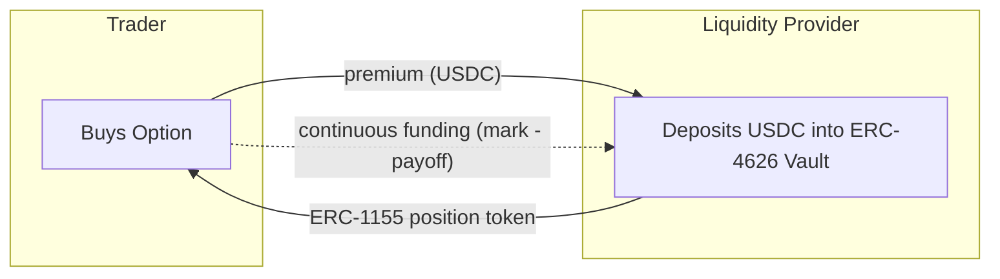
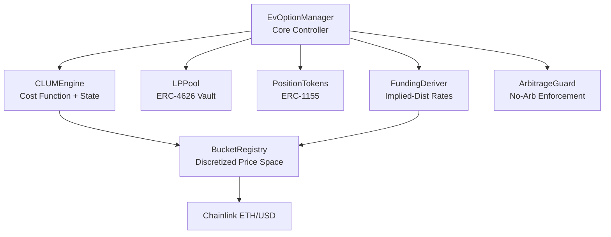

<p align="center">
  <h1 align="center">EverLast Protocol</h1>
  <p align="center">
    <strong>Everlasting Options That Never Expire</strong>
  </p>
  <p align="center">
    Trade call and put options on Base with no expiration dates. Powered by a Constant-Log-Utility Market Maker (CLUM) providing pooled liquidity with bounded-loss guarantees.
  </p>
</p>

<p align="center">
  <a href="https://everlast-protocol.vercel.app/">
    
  </a>
  <a href="https://github.com/ANRGUSC/everlast-protocol/blob/main/LICENSE">
    
  </a>
  <a href="https://soliditylang.org/">
    
  </a>
  <a href="https://base.org/">
    
  </a>
</p>

---

## Highlights

- **No Expiration** - Options stay open indefinitely, no rolling required
- **Pooled AMM Liquidity** - CLUM engine provides continuous two-sided liquidity with bounded loss for LPs
- **Market-Driven Funding** - Rates derived from the CLUM's implied probability distribution, not a parametric model
- **ERC-1155 Positions** - Semi-fungible position tokens, gas-efficient and tradeable
- **Cross-Strike Efficiency** - Arbitrage guard enforces convexity, monotonicity, and put-call parity across strikes
- **Exercise Anytime** - American-style, exercise when in-the-money
- **Built on Base** - Fast, cheap transactions on Ethereum L2

---

## Try It

**[Launch App](https://everlast-protocol.vercel.app/)**

Connect your wallet to Base Sepolia and get test tokens:
- [Base Sepolia Faucet](https://www.alchemy.com/faucets/base-sepolia) - Get test ETH
- [Circle USDC Faucet](https://faucet.circle.com/) - Get test USDC

---

## How It Works



| Action | What Happens |
|--------|--------------|
| **Buy** | Trader pays premium (computed by CLUM), receives ERC-1155 position token |
| **Sell** | Trader sells position back to CLUM at current market price |
| **Fund** | Trader deposits USDC to keep position alive (funding accrues continuously) |
| **Exercise** | Trader exercises ITM option, receives intrinsic value payout from LP pool |
| **Liquidate** | Anyone can liquidate positions with depleted funding balance |

---

## Architecture



### Core Contracts (`contracts/clum/`)

| Contract | Purpose |
|----------|---------|
| **CLUMEngine** | Core AMM: maintains quantity vector, solves `sum(pi_i * ln(C - q_i)) = U` via bisection |
| **BucketRegistry** | Discretized price space (N regular + 2 tail buckets) with oracle-driven recentering |
| **LPPool** | ERC-4626 vault backing the CLUM with bounded-loss subsidy accounting |
| **PositionTokens** | ERC-1155 semi-fungible tokens encoding option type and strike |
| **FundingDeriver** | Derives funding rates from CLUM implied distribution with premium factor |
| **ArbitrageGuard** | On-chain convexity/monotonicity checks + Merkle-verified off-chain LP bounds |
| **EvOptionManager** | Trade lifecycle: buy, sell, exercise, funding accrual, liquidation |
| **CLUMMath** | Gas-optimized fixed-point ln/exp (Solmate-derived) |

### Off-chain (`offchain/`)

| Module | Purpose |
|--------|---------|
| **clum-verifier.ts** | Computes `C(q)` off-chain with higher precision, generates verification payloads for gas-optimized large trades |

### Legacy Contracts (`contracts/`)

The original peer-to-peer contracts (`OptionManager`, `PerpetualOptionNFT`, `FundingOracle`, `CollateralVault`, `RiskParams`) remain in the repo as reference. The CLUM system replaces this model with pooled AMM liquidity.

---

## Deployed Contracts (Base Sepolia)

> Legacy peer-to-peer deployment. CLUM contracts are not yet deployed to testnet.

| Contract | Address |
|----------|---------|
| OptionManager | [`0x92768885E13B791683Cee58532125c35E943840E`](https://sepolia.basescan.org/address/0x92768885E13B791683Cee58532125c35E943840E) |
| OptionNFT | [`0xC7831161CB20d1517aD7ad642a6F41727b6AFF55`](https://sepolia.basescan.org/address/0xC7831161CB20d1517aD7ad642a6F41727b6AFF55) |
| FundingOracle | [`0xC46D4e5Ca887a47118Ca5C777972251b39902D77`](https://sepolia.basescan.org/address/0xC46D4e5Ca887a47118Ca5C777972251b39902D77) |
| USDC Vault | [`0xc6703DEE49Bf14119e63c8fB3Fa0b60212442c7e`](https://sepolia.basescan.org/address/0xc6703DEE49Bf14119e63c8fB3Fa0b60212442c7e) |
| WETH Vault | [`0xf5c6f1843Bf910A00B615c038565B0c1dEaA90cA`](https://sepolia.basescan.org/address/0xf5c6f1843Bf910A00B615c038565B0c1dEaA90cA) |
| RiskParams | [`0xe24ecE1aD46657D23fcab41e0585FBA5c4E8E61C`](https://sepolia.basescan.org/address/0xe24ecE1aD46657D23fcab41e0585FBA5c4E8E61C) |

---

## For Developers

```bash
# Clone and install
git clone https://github.com/ANRGUSC/everlast-protocol.git
cd everlast-protocol && npm install

# Run tests
npx hardhat test

# Run CLUM tests only
npx hardhat test test/CLUM.test.js

# Run frontend locally
cd frontend && npm install && npm run dev
```

### Tech Stack

- **Contracts:** Solidity 0.8.20, Hardhat, OpenZeppelin, Chainlink
- **Off-chain:** TypeScript, ethers.js
- **Frontend:** Next.js 14, wagmi, viem, RainbowKit, Tailwind CSS

---

## Security

> **Warning:** This protocol is deployed on testnet only. It has not been audited. Do not use with real funds.

---

## License

MIT License - see [LICENSE](LICENSE) for details.
